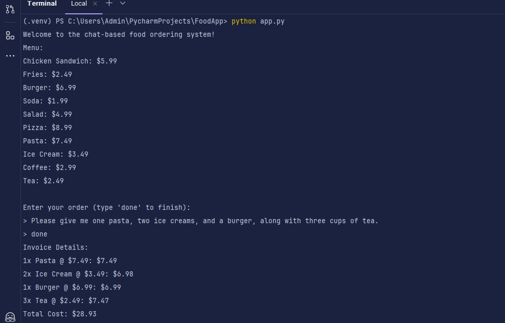

# Chat-Based Food Ordering System

This project is a command-line-based food ordering system that uses a language model (LLM) to parse user input and generate an order summary. The application features a menu, extracts food items and their quantities from user input, calculates the total cost, and generates an invoice.

---

## Features

- **Dynamic User Input Parsing**: Accepts natural language input to specify food items and their quantities.
- **Menu Validation**: Differentiates between items on the menu and those that are not.
- **Invoice Generation**: Calculates the total cost and provides an itemized invoice.
- **Preprocessing**: Converts textual numbers (e.g., "two") into numeric values.

---

## Requirements

- Python 3.8 or later
- Google Generative AI SDK
- API Key for Google Generative AI (`GOOGLE_API_KEY`)

## System Design Overview

The **Food Ordering Chat-Based System** is designed to extract user orders from natural language input, validate the items against a predefined menu, and generate a detailed invoice for valid orders.

### Components:

1. **User Interface**  
   - A terminal-based chat interface where users input their orders in natural language.

2. **Preprocessing Module**  
   - Converts user input into a normalized format.  
   - Handles vague quantities (e.g., "a", "one") and plural forms of menu items.

3. **LLM Integration**  
   - Utilizes Google Generative AI to extract ordered items and their quantities.  
   - Items are categorized as `in_menu` or `not_in_menu` based on predefined rules.

4. **Menu Validation**  
   - Compares extracted items with the menu to segregate valid items and identify invalid ones.

5. **Invoice Generator**  
   - Calculates the total cost for valid menu items.  
   - Generates an itemized invoice.

6. **Environment Configuration**  
   - Sensitive data, such as the API key, is stored securely in a `.env` file and loaded using the `python-dotenv` library.

### Flow Diagram:

`User Input → Preprocessing → LLM API → Menu Validation → Invoice Generation → Output`

### Sample Output Here
